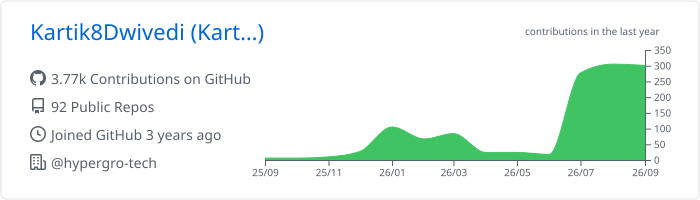
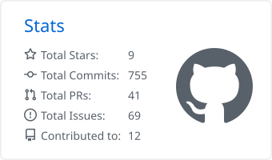
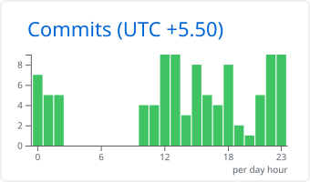
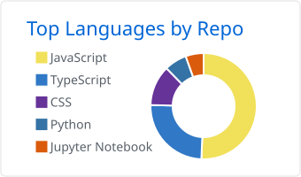
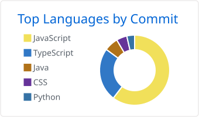

<h1 align="center">
    
</h1>

<h3 align="center">Forward Deployed Software Engineer · AI · Backend · Distributed Systems 🇮🇳</h3>

 

 💼 Software Engineer at **[Hypergro.ai](https://www.hypergro.ai/)** — building an AI video generation platform

 🔭 I work on **fault-tolerant async job queues, event-driven systems and System Design**

 🌱 Exploring **AI tool-calling pipelines, RAG and LLM-powered developer tools**

 🏆 Finalist at **Smart India Hackathon 2024** · Runner-up at **Hitachi & GlobalLogic 30Hacks**

 💬 Ask me about **Node.js, TypeScript, GCP, MongoDB, PostgreSQL and Message Queues**

 ⚡ Fun fact: **Game of Thrones Night's Watch cloaks are made from Ikea rugs**

 📄 Resume: **[View my Resume](./Resume.pdf)**

 

  
  
  
  
  

<h2 align="center">🚀 Featured Projects 🚀</h2>

| Project | What it does | Links |
|---------|--------------|-------|
| **Ditto — Duplicate-Logic Detector** | AST-analysis engine (ts-morph + Node.js VM) that detects functional logic duplicates — scanned 5,800+ open-source functions and caught a silent bug in the 64k⭐ `cline` repo | [Repo](https://github.com/Kartik8Dwivedi/Ditto) · [Live](https://ditto-flax.vercel.app) · [Demo](https://youtu.be/I5oH0Xod-eA) |
| **BlueStellers — Consultation Marketplace** | Dual-app marketplace (Next.js, Node.js, MongoDB) with Razorpay payments, Google Calendar/Meet integration and async background-job pipelines on GCP | [Client](https://bluestellers.com/) · [Expert Dashboard](https://expert.bluestellers.com/) |

<h2 align="center">⚒️ Languages-Frameworks-Tools ⚒️</h2>
 

     
     
    

 

  <h2>🐍 My Contributions 🐍</h2>
   
  <picture>
    <source media="(prefers-color-scheme: dark)" srcset="https://raw.githubusercontent.com/kartik8dwivedi/kartik8dwivedi/output/github-contribution-grid-snake-dark.svg" />
    
  </picture>

     

<h2 align="center">⚡ Stats ⚡</h2>
 

  <picture>
    <source media="(prefers-color-scheme: dark)" srcset="profile-summary-card-output/github_dark/0-profile-details.svg" />
    
  </picture>
   
  <picture>
    <source media="(prefers-color-scheme: dark)" srcset="profile-summary-card-output/github_dark/3-stats.svg" />
    
  </picture>
  <picture>
    <source media="(prefers-color-scheme: dark)" srcset="profile-summary-card-output/github_dark/4-productive-time.svg" />
    
  </picture>
   
  <picture>
    <source media="(prefers-color-scheme: dark)" srcset="profile-summary-card-output/github_dark/1-repos-per-language.svg" />
    
  </picture>
  <picture>
    <source media="(prefers-color-scheme: dark)" srcset="profile-summary-card-output/github_dark/2-most-commit-language.svg" />
    
  </picture>

  

<h3 align="center">
    
</h3>

 
